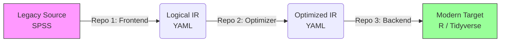

# Legacy ETL Compiler Suite
The orchestrator for the SPSS-to-R compilation toolchain.
# ETL Compiler Toolchain: Controller & Orchestrator

> **The integration layer for the Legacy SPSS-to-R Compiler Suite.**

This repository contains the orchestration scripts, end-to-end integration tests, and demo data required to run the full ETL Compiler toolchain. It acts as the "Glue" that binds the three decoupled compiler components together.

## 🏗 Architecture

The compiler follows a strict "Frontend-Backend" separation of concerns, split across three specialized repositories:



### Component Repositories

This controller requires the following components to be present in your workspace:

| Stage | Repository | Responsibility |
| --- | --- | --- |
| **1. Frontend** | [`spec_generator`](https://www.google.com/search?q=../spec_generator) | Parses raw SPSS syntax into an Abstract Syntax Tree (AST). |
| **2. Middle-end** | [`etl_optimizer`](https://www.google.com/search?q=../etl_optimizer) | Optimizes the Dependency Graph (Vertical Collapse, Dead Code Elimination). |
| **3. Backend** | [`etl-r-generator`](https://www.google.com/search?q=../etl-r-generator) | Transpiles the Optimized IR into type-safe R code (Visitor Pattern). |

---

## 🚀 Getting Started

### 1. Workspace Setup

Because the components are maintained in separate repositories, please ensure your directory structure is organized as **Siblings** in a common root folder:

```text
/workspace/
├── spec_generator/       # Clone Repo 1 here
├── etl_optimizer/        # Clone Repo 2 here
├── etl-r-generator/      # Clone Repo 3 here
└── etl_controller/       # (This Repo) Scripts & Data

```

### 2. Prerequisites

* **Python 3.12+** (For the Compiler Toolchain)
* **R** (For the Runtime Verification)
* **PSPP** (Optional: For verifying legacy logic parity)

### 3. Running the "Tactile" Demo

The `run_presentation.sh` script is a guided, interactive demo designed for stakeholders. It runs the legacy code (PSPP), runs the compiler, and compares the outputs side-by-side.

```bash
./run_presentation.sh

```

### 4. Compiling Your Own Code

Use the production binary wrapper `etl_compiler.sh` to compile any SPSS file.

```bash
# Usage: ./etl_compiler.sh <input_logic.sps> <input_data.csv>

./etl_compiler.sh ./demo/input/logic.sps ./demo/input/data.csv

```

---

## 📂 Directory Structure

* `demo/`: Contains validated test cases.
* `input/`: Raw `.sps` logic and `.csv` data.
* `expected/`: The "Ground Truth" results generated by PSPP.


* `etl_compiler.sh`: The main entry point for the toolchain.
* `run_presentation.sh`: A "Teleprompter" style script for live demos.

---

## 🧪 Verification Strategy

This repository ensures **Functional Parity** via a "Black Box" testing strategy:

1. **Legacy Run:** Input Data + Logic is run through **PSPP**.
2. **Modern Run:** Input Data + Logic is compiled to **R** and executed.
3. **Comparison:** The output CSVs from both runs are compared for exact matches (Row counts, Column values).

## 📜 License

MIT

```

---

### ⚠️ Crucial Adjustment for "Separate Repos"

Since you are keeping them separate (Siblings), you need to update the `REPO` paths in your scripts (`etl_compiler.sh` and `run_presentation.sh`) one last time to look **"one folder up"**.

**In `etl_compiler.sh` (and similarly in `run_presentation.sh` if it references paths):**

```bash
# OLD (Monorepo/Nested):
# REPO_1="components/spec_generator"

# NEW (Sibling Repos):
REPO_1="../spec_generator"
REPO_2="../etl_optimizer"
REPO_3="../etl-r-generator"

```

This ensures that when you run the script inside `etl_controller`, it successfully hops up one level and finds the sibling folders.