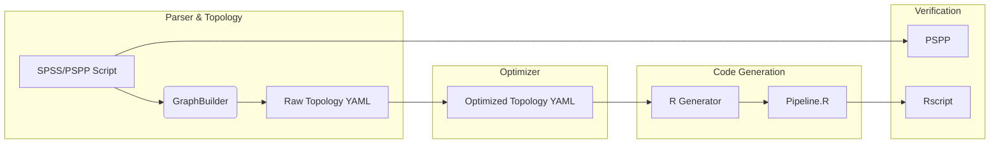
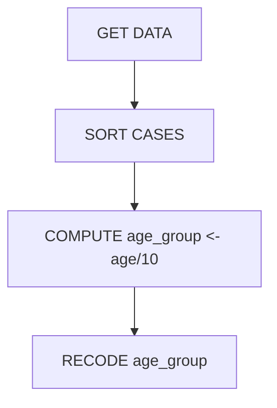

## Overview

- Purpose: migrate SPSS/PSPP logic into R pipelines
- Verification & validation cycle

---

## Architecture



---

## State Machine

- Operations = nodes
- States = datasets
- Enables dependency checking & optimizations



---

## Environment Considerations

- Linux (Rscript + PSPP easily installed)
- Windows: R via VS Code, PSPP absent -> configurable commands or skip

---

## Usage

```bash
python src/compiler.py --manifest demo/input/logic.sps \
  --pspp-cmd "echo PSPP skipped" \
  --rscript-cmd Rscript
```

---

## Questions?

*Detailed notes available in `docs/system_explanation.qmd`.*
