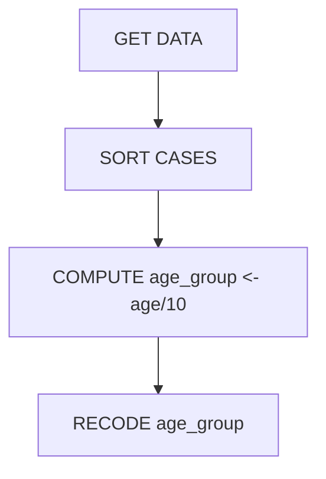

# Overview

This document explains the *legacy ETL compiler* system, its architecture, execution pipeline, and configuration options. It is written in Quarto to support rich HTML/PDF output for presentations or reference.

[TOC]

---

# 1. Introduction

- **Purpose**: Migrate legacy SPSS/PSPP scripts into reproducible, maintainable R/Tidyverse pipelines.
- **Key components**: parser, optimizer, R generator, verification stages.
- **Usage contexts**: development Linux environment, constrained Windows environment with limited admin privileges.

> _Note_: this explanation assumes familiarity with SPSS syntax and R language.

---

# 2. Project Structure

```
├── src/                   # Core compiler implementation (Python)
│   ├── compiler.py        # CLI entry point & orchestration
│   └── ...                # helpers and utilities
├── tests/                 # pytest-based integration/unit tests
├── demo/                  # sample inputs for demonstrations
├── dist/                  # generated artifacts (verification, code)
├── docs/                  # documentation (this file)
├── README.md             
└── ...
```

Additional repositories (via submodules or relative paths) supply `spec_generator`, `etl-ir-core`, `etl-optimizer`, `etl-r-generator`.

---

# 3. Execution Pipeline

::: callout-note
This document now includes a dedicated section explaining the **state machine / topology** created during parsing. See section 3.1 below.
:::


The compiler performs a **verification-and-validation (V&V) cycle** consisting of five stages:

1. **Source Verification**: run legacy logic through PSPP (or SPSS emulator) to confirm initial script executes and outputs match expectations.
2. **Parsing & Raw Topology**: SPSS/PSPP parser converts syntax into abstract syntax tree (AST), then graph builder produces a pipeline model.
3. **Optimization**: Semantics-based passes simplify the pipeline (dead-code elimination, parameter resolution, etc.).
4. **Code Generation**: R generator translates the optimized pipeline into idiomatic [`tidyverse`](https://www.tidyverse.org/) R code.
5. **Target Verification**: execute the generated R code using `Rscript`; compare results against PSPP reference.

Each stage produces artifacts under `dist/verification/` (`01_source_verification.txt`, `02_raw_topology.yaml`, etc.) that can be audited.

## 3.1 Implementation details

### 3.1.1 State Machine / Topology

When the SPSS/PSPP parser ingests a script it does not simply generate linear code; instead it builds a
**state machine** representation of the pipeline. Each SPSS command (e.g. `GET DATA`, `SORT CASES`,
`COMPUTE`, `RECODE`) becomes an **operation node**, and datasets (or intermediate result sets) are
modeled as **states**. Links between nodes form a directed acyclic graph that resembles a workflow or
finite state automaton.

Below is a simplified mermaid diagram showing how a short script might be represented:



*Why a state machine?*

1. **Explicit dependencies** – every operation knows its inputs and outputs, so the compiler can
   detect cycles, dead branches, and ghost columns before generating R code.
2. **Optimization-friendly** – you can apply graph transforms (merge adjacent operations, remove
   no-ops, push filters upstream) using well-understood algorithms from compilers and dataflow
   systems.
3. **Auditable artifacts** – the `02_raw_topology.yaml` and `03_optimized_topology.yaml` files are
   human-readable dumps of the state machine. Auditors or reviewers can trace exactly how a legacy
   script was interpreted and transformed.
4. **Platform-agnostic generation** – the same graph can be compiled to R, SQL, or other target
   languages by swapping out the code generator (future work).

The **pipeline model** is implemented in `etl_ir.model.Pipeline` where each `Operation` holds its
`inputs`, `outputs`, `parameters`, and a unique identifier. GraphBuilder in `spec_generator` creates
this model; the optimizer then mutates it and the R generator walks it to emit code.


The orchestration lives in `src/compiler.py`:

```python
run_command([pspp_cmd, sps_file], log_path)
# ... parser/optimizer/generator steps ...
run_command([rscript_cmd, r_path], log_path)
```

Two command-line options (`--pspp-cmd` and `--rscript-cmd`) make executables configurable for constrained environments.

---

# 4. Configuration & Environment

::: callout-tip
For colleagues running the compiler on their own Linux machines the full V&V cycle can be executed: PSPP is available via the package manager and Rscript runs natively. On the ONS Windows platform, PSPP cannot currently be installed and R is only accessible through an extension; this means the source‑verification stage is effectively a no‑op and the target verification must rely on the R extension or a separate environment.

If you need to inspect implementation details, the project depends on four sibling repositories:

- `../spec_generator` – parser & graph builder
- `../etl-ir-core` – pipeline model definitions
- `../etl-optimizer` – semantic transformation passes
- `../etl-r-generator` – code generator for R

Access to these directories (e.g. by cloning them in parallel or using git submodules) allows you to run the full test suite and extend language coverage. Without them, the CLI still functions, but only at a high level.

The compiler is a **work in progress**: not all SPSS/PSPP language features are supported yet, and the PSPP capability matrix (see `tests/test_system_integration.py`) documents which commands have been exercised. It is a functional proof-of-concept demonstrating that legacy logic can be faithfully translated into R, but edge cases remain.
:::


## 4.1 Python environment

- Managed via `pyproject.toml` and `requirements.txt`.
- Virtual environment is created by `python -m venv .venv`.

## 4.2 R environment

- Requires R >= 4.4 with packages: `tidyverse`, `haven`, `lubridate`, etc.
- On Linux, Rscript is invoked directly; on Windows you may use the VS Code R extension or portable binaries.
- Example command:

```powershell
Rscript --version
python src/compiler.py --manifest demo/input/logic.sps --rscript-cmd Rscript
```

## 4.3 PSPP/PSPP alternatives

- PSPP (open-source SPSS clone) is used for source verification.
- On Linux, install via package manager (`apt install pspp`).
- On Windows, use a build from [GNU PSPP](https://www.gnu.org/software/pspp/) if available or request through artifactory; otherwise the stage can be skipped with a warning.

### 4.3.1 Skipping PSPP

The CLI options allow `--pspp-cmd` to point to an innocuous script that logs a message and exits 0 when PSPP is unavailable.

---

# 5. Tests and Compliance

- `tests/test_system_integration.py` verifies the compiler against a "golden list" of SPSS features that PSPP supports (PSPP capability matrix).
- Running a subset:

```bash
PYTHONPATH=$PWD/src pytest tests/test_system_integration.py::TestSystemIntegration::test_pspp_compliance
```

- Unit tests cover smaller modules under `tests/unit` and `tests/system`.

---

# 6. Running the Pipeline

Basic invocation:

```bash
python src/compiler.py --manifest path/to/manifest.yaml
```

*Manifests* may be YAML files specifying input script and output location, or a direct `.sps` path. The compiler handles both.

Additional flags:

- `--pspp-cmd`: override PSPP command
- `--rscript-cmd`: override Rscript command

Example for a Windows machine without PSPP installed:

```powershell
python src/compiler.py --manifest demo/input/logic.sps --pspp-cmd "echo PSPP skipped" --rscript-cmd Rscript
```

> **Tip**: wrap `pspp` and `Rscript` in custom shell scripts if you need to invoke remote services or VPN wrappers.

---

# 7. Troubleshooting Topics

- **Missing executables**: `run_command` prints "Tool Not Found (Skipped)"; ensure path or wrapper is provided.
- **Parser errors**: inspect `dist/verification/02_raw_topology.yaml` for parse issues.
- **R failures**: check `05_target_verification.txt` for Rscript output.
- **Permission errors on Windows**: use user-local virtual environments and avoid installation requiring admin rights.

---

# 8. Frequently Asked Questions & Notes

- **Can I run the pipeline remotely?** Yes; the CLI is pure Python and OS‑agnostic. You could SSH to a Linux host, or call the CLI from a CI job.
- **What about R packages not available?** They must be installed with `install.packages()` in the R environment; the demo R script uses base packages and tidyverse.
- **How do I add new SPSS features?** Extend the `spec_generator` parser and update the capability tests.
- **Why two topologies?** Raw and optimized graphs help to audit transformations and prove semantics preservation.

> _Note for questions_: the `tests` directory contains scenarios demonstrating feature support; feel free to open them during your presentation if needed.

---

# 9. Appendix: Command Reference

| Command | Purpose |
|---------|---------|
| `python src/compiler.py --manifest ...` | Run compiler on manifest or script |
| `pytest tests/...` | Execute tests |
| `Rscript script.R` | Execute R code for verification |
| `pspp script.sps` | Execute legacy logic via PSPP |

---

*End of document.*
